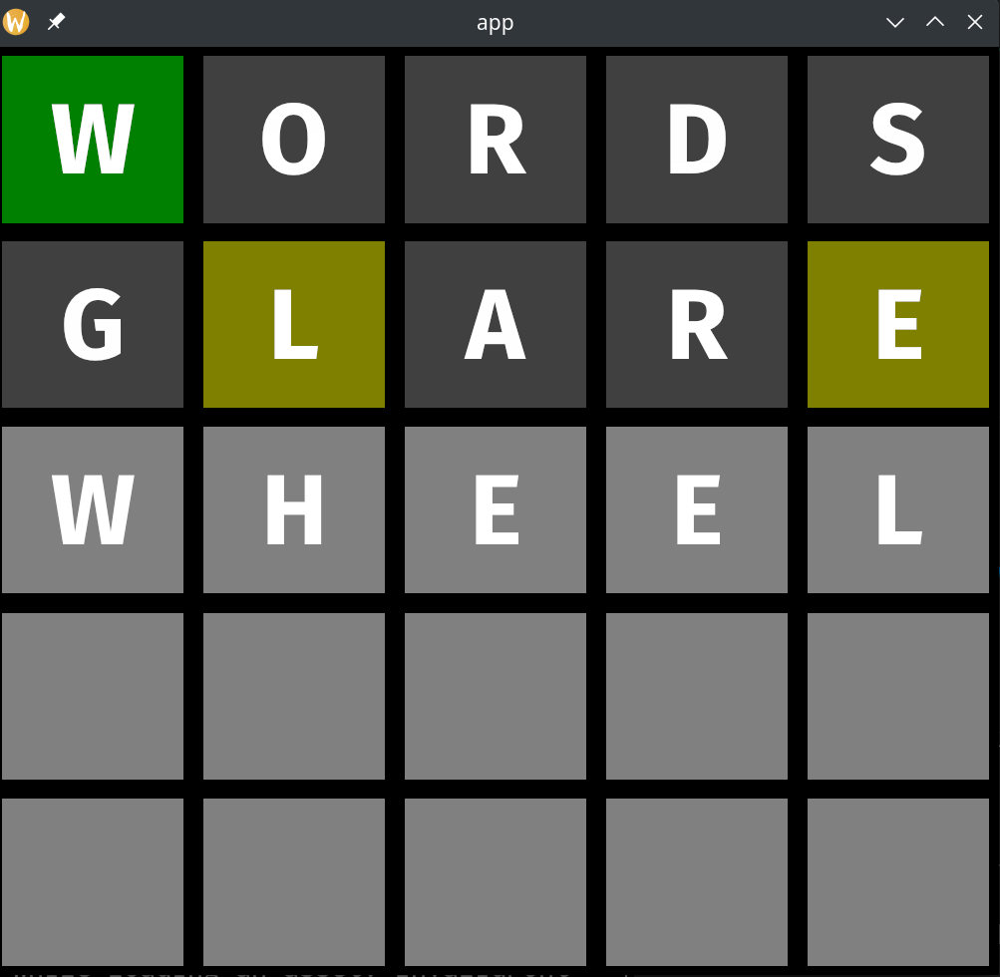

# OwO what's this

Werdol is a very crummy desktop application Wordle clone. It's Wordle, but worse.

This was a proof-of-concept intended to experiment with the [ECS architectural patttern](https://en.wikipedia.org/wiki/Entity_component_system) using Rust's [Bevy ECS library](https://bevyengine.org/). In retrospect, Wordle doesn't lend itself super well to ECS, so it was probably not the best introduction.

# Building it

Recent versions of Bevy require a nightly version of the Rust toolchain (at the time of writing). Ordinarily, this would be [somewhat annoying](https://bevyengine.org/learn/book/getting-started/setup/), but the Nix flake can take care of all the annoying parts.

Assuming you have a [Nix installation](https://nixos.org/download.html) and you've [enabled flakes](https://nixos.wiki/wiki/Flakes#Enable_flakes), you can just:

* Run `nix build` here to reproducibly build the Werdol binary.

* Run `nix develop` to get a development shell with an LSP server and all the usual Rust goodies. You can run `cargo build` here and everything should "just work".

* Do [all the usual handy Nix/flake-enabled stuff](https://nixos.org/manual/nix/unstable/command-ref/new-cli/nix3-flake.html).

## Building without Nix

I haven't tried this, but you'd probably need `cmake` and some dev headers for `udev`, `libxkbcommon`, and stuff like that (the package definition inside the `flake.nix` should give you a clue).

# What doesn't work

Look, this is a _very_ bad clone. I never really bothered with the word list / word validation parts of the game. Yes, those are essential parts of the Wordle game. However, my main concern was learning the graphics/input handling parts of the problem.

There's a silver lining: you can ask unsuspecting friends to play it and laugh with them when the word is revealed to be random gibberish. You can also ask unsuspecting _enemies_ to play it and laugh _at_ them.

# What might work

I've only ever built this on Linux. It might almost build on MacOS, but its dependence on platform-specific graphics libraries means that you'll probably need to tweak the `buildInputs` to swap out some of the non-Rust libraries that Bevy abstracts over.
